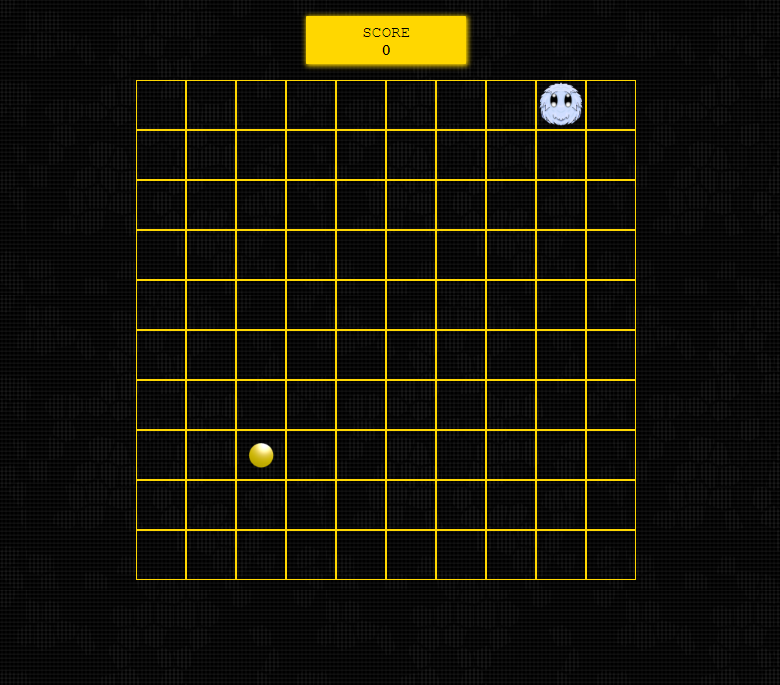

# Furry Game
The hero of our game is ** Furry **, which moves on a 10x10 square board. 

There is a coin on the random field of the board. The player controlling Furry using the arrows on the keyboard must reach the coin. When he does, the coin disappears from the board and appears on another field, also random, and the player gets 1 point.

When the player hits the wall, the game ends.

## Demo
Click the link - https://waldemarciupa.github.io/FurryGame/

## Technologies
Project is created with:
* HTML
* CSS
* JavaScript
